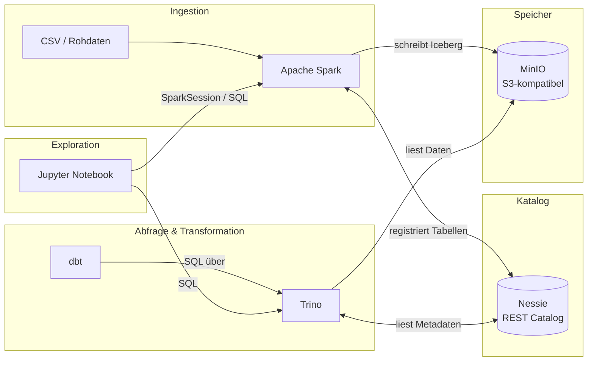

# 🏠 Mini-Lakehouse

Docker-basierte Sandbox, die die Kernkonzepte eines AI-Ready Self-Service Lakehouse demonstriert.

---

## Schnellstart

### Mit Docker (lokal)

```bash
git clone https://github.com/dev400-jd/mini-lakehouse.git
cd mini-lakehouse
make up
```

### Ohne Docker (GitHub Codespaces)

Auf GitHub → **Code** → **Codespaces** → „Create codespace on main". Die Umgebung startet vollständig im Browser, ohne lokale Installation.

[](https://codespaces.new/dev400-jd/mini-lakehouse)

### Beispieldaten laden

```bash
make seed
```

Danach ist die Umgebung bereit. `make demo` lädt Daten und öffnet Jupyter direkt im Browser.

---

## Was zeigt die Sandbox?

- **Separation of Storage and Compute** — Spark schreibt Daten, Trino liest dieselben Daten; kein gemeinsamer Compute-Layer
- **Apache Iceberg** — Time Travel, Schema Evolution und Hidden Partitioning auf Basis offener Tabellenspezifikation
- **Medallion-Architektur** — dreistufige Layer-Trennung: Raw → Staging → Curated
- **dbt-Transformationen** — dbt-Modelle laufen über Trino direkt auf Iceberg-Tabellen
- **Iceberg REST Catalog** — Nessie als versionierter Katalog mit Web-UI und Git-ähnlichem Branching

---

## Architektur



---

## Services & Ports

| Service          | Port   | URL                                        | Beschreibung                          |
|------------------|--------|--------------------------------------------|---------------------------------------|
| MinIO Console    | 9001   | http://localhost:9001                      | Objektspeicher Web-UI                 |
| MinIO API        | 9000   | http://localhost:9000                      | S3-kompatibler Endpunkt               |
| Nessie UI        | 19120  | http://localhost:19120                     | Iceberg-Katalog mit Branch-Übersicht  |
| Trino Web UI     | 8080   | http://localhost:8080                      | Query-Übersicht und Cluster-Status    |
| Jupyter          | 8888   | http://localhost:8888?token=lakehouse      | Notebook-Umgebung                     |
| Spark Master UI  | 8081   | http://localhost:8081                      | Spark-Cluster-Übersicht               |

> Ports sind über `.env` konfigurierbar. Standard-Zugangsdaten: Benutzer `lakehouse`, Passwort `lakehouse123`.

---

## Notebooks

| Notebook | Inhalt |
|----------|--------|
| `01_ingest.ipynb` | Rohdaten per Spark als Iceberg-Tabelle in MinIO schreiben (Raw-Layer) |
| `02_time_travel.ipynb` | Iceberg-Snapshots abfragen und frühere Tabellenzustände wiederherstellen |
| `03_schema_evolution.ipynb` | Spalten hinzufügen und entfernen, ohne bestehende Daten zu migrieren |
| `04_trino_query.ipynb` | Dieselben Iceberg-Tabellen über Trino per SQL abfragen (Compute-Trennung) |
| `05_dbt_pipeline.ipynb` | dbt-Transformationen von Staging nach Curated nachvollziehen und prüfen |

---

## Voraussetzungen

- **Docker Desktop** — mindestens 12 GB RAM zuweisen (Einstellungen → Resources)
- **oder:** GitHub-Account für Codespaces (kein lokales Setup nötig)
- `git`, `make`

---

## Weiterführend

- [docs/SETUP.md](docs/SETUP.md) — Detaillierte Installationsanleitung und Troubleshooting
- [docs/DEMO-SCRIPT.md](docs/DEMO-SCRIPT.md) — Geführtes Demo-Skript für Präsentationen
- [docs/ARCHITECTURE.md](docs/ARCHITECTURE.md) — Architekturentscheidungen und Komponentenübersicht

> Diese Dokumentation entsteht in AP-8.

---

## Mapping Sandbox → Produktion

Diese Sandbox spiegelt die geplante Architektur des Lakehouse auf der FI-TS Finance Cloud wider. Nessie übernimmt in der Demo die Rolle des Iceberg REST Catalog (in Produktion: Polaris); MinIO steht stellvertretend für den S3-kompatiblen Objektspeicher der FI-TS. Spark, Trino, Iceberg und die Medallion-Schichtung sind in beiden Umgebungen identisch.
