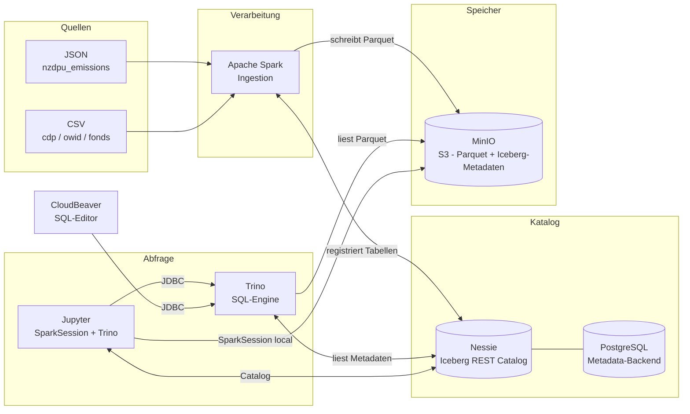

# Mini-Lakehouse

Docker-basierte Sandbox, die die Kernkonzepte eines modernen Lakehouse demonstriert:
Apache Iceberg als offenes Tabellenformat, Nessie als versionierter Katalog, Spark zum Schreiben, Trino zum Abfragen — alles auf MinIO als S3-kompatiblem Objektspeicher.

---

## Schnellstart

```bash
git clone https://github.com/dev400-jd/mini-lakehouse.git
cd mini-lakehouse

docker compose up -d        # alle 7 Services starten
make seed                   # Beispieldaten laden (ca. 3 Min)
```

Danach im Browser:

| Was | URL |
|-----|-----|
| Jupyter (Notebooks) | http://localhost:8888?token=lakehouse |
| CloudBeaver (SQL-Editor) | http://localhost:8978 |
| MinIO Console | http://localhost:9001 |
| Nessie UI | http://localhost:19120 |
| Trino Web UI | http://localhost:8080 |
| Spark Master UI | http://localhost:8081 |

---

## Services & Ports

| Service | Port(s) | Beschreibung |
|---------|---------|--------------|
| MinIO API | 9000 | S3-kompatibler Objektspeicher |
| MinIO Console | 9001 | Web-UI: Buckets, Objekte, Pfade |
| PostgreSQL | 5432 | Metastore-Backend fuer Nessie |
| Nessie | 19120 | Iceberg REST Catalog mit Branch-Uebersicht |
| Trino | 8080 | Verteilte SQL-Engine, Web-UI |
| Spark Master | 7077 / 8081 | Spark-Cluster (7077 intern, 8081 Web-UI) |
| Jupyter | 8888 | Notebook-Umgebung (Token: `lakehouse`) |
| CloudBeaver | 8978 | Web-basierter SQL-Editor fuer Trino |

Alle Ports und Credentials sind in `.env` konfigurierbar. Standard: Benutzer `lakehouse`, Passwort `lakehouse123`.

---

## Architektur



---

## Notebooks

| Notebook | Inhalt |
|----------|--------|
| `01_iceberg_erkunden.ipynb` | Anatomie einer Iceberg-Tabelle: Data Files, Manifest Files, Snapshots, Partitionen |
| `02_time_travel_schema_evolution.ipynb` | NZDPU aendert sein API-Format: Schema Evolution, Feld-Mapping, Time Travel per Snapshot-ID |

Beide Notebooks setzen `make seed` voraus.
Vor dem manuellen Durchlauf von Notebook 02 muss `make seed` erneut ausgefuehrt werden, da das Notebook die Tabelle veraendert.

---

## Beispieldaten

`make seed` laedt fuenf Tabellen in den Raw Layer (`s3://raw/`):

| Tabelle | Format | Zeilen | Beschreibung |
|---------|--------|--------|--------------|
| `nzdpu_emissions` | JSON, nested | 90 | CO2-Emissionen (Scope 1-3) von 30 europaeischen Unternehmen, 3 Jahre |
| `cdp_emissions` | CSV | 100 | CDP Climate Change Questionnaire — unreine Daten fuer Staging-Demo |
| `owid_co2_countries` | CSV | 100 | CO2 pro Land und Jahr, partitioniert nach `year` |
| `fund_master` | CSV | 10 | Fondsstammdaten mit ISINs |
| `fund_positions` | CSV | 319 | Fondspositionen, partitioniert nach `position_date` |

Datengenerierung (Fallback-Daten sind bereits im Repository enthalten):

```bash
uv run scripts/generate-sample-data.py
```

---

## Voraussetzungen

- **Docker Desktop** mit mindestens 12 GB RAM
  - Windows: WSL2-Backend aktivieren und `.wslconfig` anpassen (siehe [docs/SETUP.md](docs/SETUP.md))
- **git**, **make**
- **uv** — nur fuer `scripts/generate-sample-data.py`, optional

---

## Konfiguration

Alle Versionen, Ports und Credentials stehen in `.env` (Single Source of Truth).
Docker Compose und alle Skripte lesen ausschliesslich aus dieser Datei.

---

## Weiterfuehrendes

- [docs/SETUP.md](docs/SETUP.md) — Installation, WSL2-Konfiguration, Troubleshooting
- [docs/ARCHITECTURE.md](docs/ARCHITECTURE.md) — Komponentenuebersicht, Mapping Sandbox zu Produktion
- [docs/DEMO-SCRIPT.md](docs/DEMO-SCRIPT.md) — Gefuehrtes Demo-Skript (30 Min / 60 Min)
