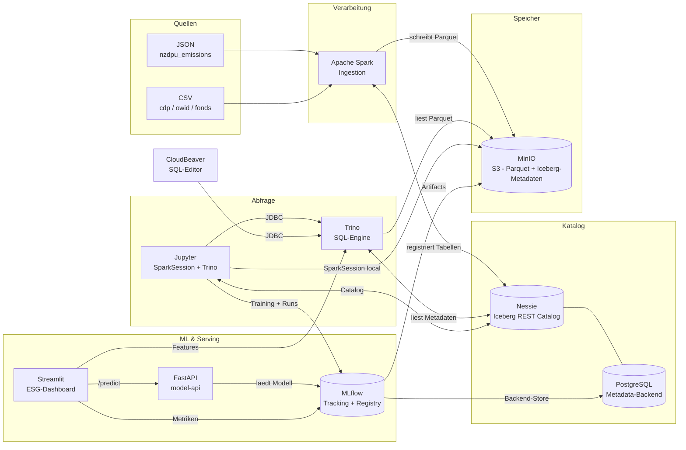

# Mini-Lakehouse

Docker-basierte Sandbox, die die Kernkonzepte eines modernen Lakehouse demonstriert:
Apache Iceberg als offenes Tabellenformat, Nessie als versionierter Katalog, Spark zum Schreiben, Trino zum Abfragen — alles auf MinIO als S3-kompatiblem Objektspeicher.

---

## Schnellstart

```bash
git clone https://github.com/dev400-jd/mini-lakehouse.git
cd mini-lakehouse

docker compose up -d        # alle 7 Services starten
make seed                   # Beispieldaten laden (ca. 3 Min)
```

**Windows (ohne make):**

```powershell
docker compose up -d
bash scripts/seed-data.sh
```

Danach im Browser:

| Was | URL |
|-----|-----|
| ESG-Dashboard (Streamlit) | http://localhost:8501 |
| Model-API (FastAPI / Swagger) | http://localhost:8000/docs |
| Jupyter (Notebooks) | http://localhost:8888?token=lakehouse |
| CloudBeaver (SQL-Editor) | http://localhost:8978 |
| MLflow (Experiment-Tracking) | http://localhost:5555 |
| MinIO Console | http://localhost:9003 |
| Nessie UI | http://localhost:19120 |
| Trino Web UI | http://localhost:8080 |
| Spark Master UI | http://localhost:8085 |

---

## Services & Ports

| Service | Port(s) | Beschreibung |
|---------|---------|--------------|
| MinIO API | 9002 | S3-kompatibler Objektspeicher |
| MinIO Console | 9003 | Web-UI: Buckets, Objekte, Pfade |
| PostgreSQL | 5432 | Metastore-Backend fuer Nessie + MLflow |
| Nessie | 19120 | Iceberg REST Catalog mit Branch-Uebersicht |
| Trino | 8080 | Verteilte SQL-Engine, Web-UI |
| Spark Master | 7077 / 8085 | Spark-Cluster (7077 intern, 8085 Web-UI) |
| Jupyter | 8888 | Notebook-Umgebung (Token: `lakehouse`) |
| CloudBeaver | 8978 | Web-basierter SQL-Editor fuer Trino |
| MLflow | 5555 | Experiment-Tracking & Model Registry |
| Model-API (FastAPI) | 8000 | REST-Serving des registrierten Modells (`/predict`, `/health`, Swagger unter `/docs`) |
| Streamlit ESG-Dashboard | 8501 | Praesentations-App: Modellergebnisse, Cluster-Verteilung, interaktiver Fonds-Rechner |

> Hinweis: MinIO (9002/9003) und Spark-UI (8085) weichen von den ueblichen
> Standard-Ports (9000/9001, 8081) ab, weil auf der Workshop-Maschine bereits
> andere Container diese Ports belegen. Alle Ports sind in `.env` konfigurierbar.

Alle Ports und Credentials sind in `.env` konfigurierbar. Standard: Benutzer `lakehouse`, Passwort `lakehouse123`.

---

## Architektur



---

## Notebooks

| Notebook | Inhalt |
|----------|--------|
| `01_iceberg_erkunden.ipynb` | Anatomie einer Iceberg-Tabelle: Data Files, Manifest Files, Snapshots, Partitionen |
| `02_time_travel_schema_evolution.ipynb` | NZDPU aendert sein API-Format: Schema Evolution, Feld-Mapping, Time Travel per Snapshot-ID |
| `03_ml_fonds_co2_fussabdruck.ipynb` | Data-Science-Projekt mit MLflow: Fonds-CO₂-Fußabdruck aus Holdings + Emissionen, ESG-Clustering (KMeans), Experiment-Tracking & Model Registry |

Beide Notebooks setzen `make seed` voraus.
Vor dem manuellen Durchlauf von Notebook 02 muss `make seed` erneut ausgefuehrt werden, da das Notebook die Tabelle veraendert.

---

## Beispieldaten

`make seed` laedt fuenf Tabellen in den Raw Layer (`s3://raw/`):

| Tabelle | Format | Zeilen | Beschreibung |
|---------|--------|--------|--------------|
| `nzdpu_emissions` | JSON, nested | 90 | CO2-Emissionen (Scope 1-3) von 30 europaeischen Unternehmen, 3 Jahre |
| `cdp_emissions` | CSV | 100 | CDP Climate Change Questionnaire — unreine Daten fuer Staging-Demo |
| `owid_co2_countries` | CSV | 100 | CO2 pro Land und Jahr, partitioniert nach `year` |
| `fund_master` | CSV | 10 | Fondsstammdaten mit ISINs |
| `fund_positions` | CSV | 319 | Fondspositionen, partitioniert nach `position_date` |

Datengenerierung (Fallback-Daten sind bereits im Repository enthalten):

```bash
uv run scripts/generate-sample-data.py
```

---

## Voraussetzungen

- **Docker Desktop** mit mindestens 12 GB RAM
  - Windows: WSL2-Backend aktivieren und `.wslconfig` anpassen (siehe [docs/SETUP.md](docs/SETUP.md))
- **git**
- **make** — optional, auf Windows nicht standardmaessig vorhanden (Alternativen siehe Schnellstart)
- **uv** — nur fuer `scripts/generate-sample-data.py`, optional

---

## Konfiguration

Alle Versionen, Ports und Credentials stehen in `.env` (Single Source of Truth).
Docker Compose und alle Skripte lesen ausschliesslich aus dieser Datei.

---

## Machine Learning mit MLflow

Der Stack enthaelt einen integrierten **MLflow Tracking Server** — er nutzt dieselben
Backing-Services wie das Lakehouse: PostgreSQL als Backend-Store (DB `mlflow`) und
MinIO als Artifact-Store (Bucket `mlflow`). Trainingsdaten kommen aus dem Iceberg-
`raw`-Layer via Trino.

```
Iceberg (Trino) --> Jupyter (Training) --> MLflow Server --> PostgreSQL (Runs/Metriken)
                                                        \--> MinIO (Modelle/Artefakte)
                                                         --> MLflow UI (http://localhost:5555)
```

**Beispielprojekt** (`notebooks/03_ml_fonds_co2_fussabdruck.ipynb`): Fonds-CO₂-Fußabdruck
aus Fondspositionen + Unternehmensemissionen, danach ESG-Clustering der Fonds (KMeans)
mit k-Sweep. Jeder Lauf wird als MLflow-Run mit Parametern, Silhouette-Score, Modell
und Cluster-Plot geloggt; das beste Modell landet in der Model Registry.

```bash
make train          # fuehrt scripts/train-fund-carbon.py im jupyter-Container aus
```

Danach in der **MLflow UI** (http://localhost:5555): Experiment `fonds-co2-fussabdruck`
oeffnen, Runs vergleichen, Artefakte ansehen, Modell `fonds-esg-clustering` in der
Registry auf *Staging*/*Production* setzen.

---

## Weiterfuehrendes

- [docs/SETUP.md](docs/SETUP.md) — Installation, WSL2-Konfiguration, Troubleshooting
- [docs/ARCHITECTURE.md](docs/ARCHITECTURE.md) — Komponentenuebersicht, Mapping Sandbox zu Produktion
- [docs/DEMO-SCRIPT.md](docs/DEMO-SCRIPT.md) — Gefuehrtes Demo-Skript (30 Min / 60 Min)
